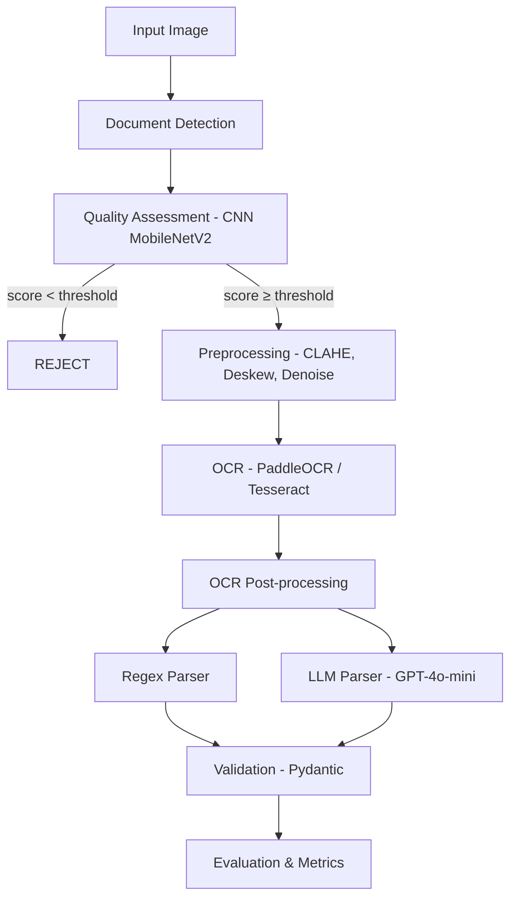

# 🧾 Invoice AI

> End-to-end Document AI pipeline for structured data extraction from receipts and invoices.

[](https://www.python.org/downloads/)
[](LICENSE)

## Overview

Pipeline completa de Document AI que transforma imagens de notas fiscais/recibos em dados estruturados (JSON), com experimentos comparativos rigorosos entre abordagens tradicionais (Regex) e modernas (LLM).

```
Image → Document Detection → Quality Assessment (CNN) → Preprocessing → OCR → Parsing → JSON
```

## Architecture



## Key Features

- **Preprocessing**: CLAHE, deskew, perspective correction, adaptive threshold
- **Quality Gate**: CNN (MobileNetV2) trained on synthetic degradations to reject low-quality inputs
- **OCR**: PaddleOCR (SOTA) + Tesseract (baseline) comparison
- **Parsing**: Regex vs LLM (GPT-4o-mini) with rigorous experimental comparison
- **Metrics**: CER, WER, Field-level F1, ANLS, Exact Match, latency, cost

## Dataset

[CORD-v2](https://huggingface.co/datasets/naver-clova-ix/cord-v2) — 1000 receipt images with 30 structured fields, CC-BY-4.0 license.

## Quick Start

```bash
# Clone
git clone https://github.com/Bruno-Kohn/invoice-ai.git
cd invoice-ai

# Install
pip install -e ".[dev]"

# See available commands
make help

# Run full pipeline
make all
```

## Project Structure

```
invoice-ai/
├── configs/          # YAML configuration files
├── data/             # Raw, processed, and synthetic datasets
├── models/           # Trained model weights
├── notebooks/        # Jupyter notebooks (EDA, experiments, results)
├── results/          # Metrics, figures, and sample outputs
├── src/              # Source code
│   ├── preprocessing/  # Image enhancement and correction
│   ├── quality/        # CNN quality assessment model
│   ├── ocr/            # OCR engine wrappers
│   ├── parsing/        # Regex and LLM parsers
│   ├── evaluation/     # Metrics and visualization
│   └── utils/          # Shared utilities
└── tests/            # Unit tests
```

## Experiments

| #     | Experiment             | What it measures                           |
| ----- | ---------------------- | ------------------------------------------ |
| 1-5   | Preprocessing ablation | Impact of each technique on CER            |
| 6     | PaddleOCR vs Tesseract | CER, WER, latency                          |
| 7-8   | CNN quality filter     | Trade-off rejection rate vs output quality |
| 9-10  | Regex vs LLM           | F1, latency, cost, robustness              |
| 11-13 | Pipeline variants      | End-to-end performance                     |

## Tech Stack

- **CV**: OpenCV, Pillow
- **OCR**: PaddleOCR, Tesseract
- **DL**: PyTorch, torchvision (MobileNetV2)
- **LLM**: OpenAI GPT-4o-mini
- **Validation**: Pydantic v2
- **Metrics**: scikit-learn, editdistance

## License

MIT
