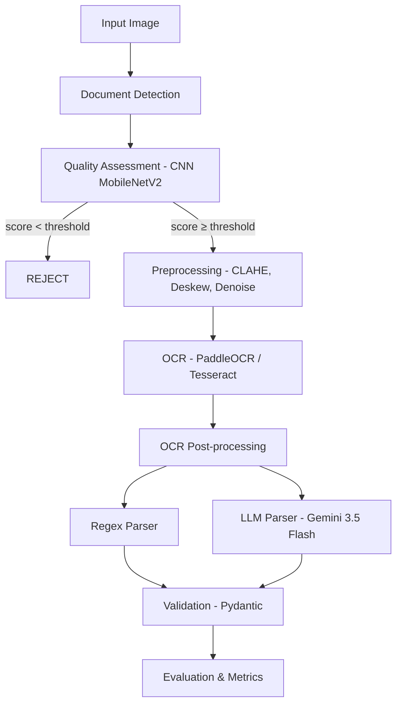

# 🧾 Invoice AI

> End-to-end Document AI pipeline for structured data extraction from receipts and invoices.

[](https://www.python.org/downloads/)
[](LICENSE)
[](https://github.com/PaddlePaddle/PaddleOCR)
[](https://ai.google.dev/)
[](https://pytorch.org/)

## Overview

Pipeline completa de Document AI que transforma imagens de notas fiscais/recibos em dados estruturados (JSON), com **13 experimentos comparativos** entre abordagens tradicionais e modernas.

### Key Results

| Metric | Value |
|--------|-------|
| **CER reduction** (preprocessing) | -46% |
| **PaddleOCR vs Tesseract** | 4x better quality |
| **LLM vs Regex parser** | +23% F1, +44% ANLS |
| **CNN Quality Gate** (threshold 0.3) | -43% CER, 30% rejected |
| **Full pipeline F1** | 0.554 (Regex) / 0.681 (LLM) |

```
Image → Document Detection → Quality Assessment (CNN) → Preprocessing → OCR → Parsing → JSON
```

## Architecture



## Key Features

- **Preprocessing**: CLAHE, deskew, perspective correction, adaptive threshold
- **Quality Gate**: CNN (MobileNetV2) trained on synthetic degradations to reject low-quality inputs
- **OCR**: PaddleOCR (SOTA) + Tesseract (baseline) comparison
- **Parsing**: Regex vs LLM (Gemini 3.5 Flash) with rigorous experimental comparison
- **Metrics**: CER, WER, Field-level F1, ANLS, Exact Match, latency, cost

## Dataset

[CORD-v2](https://huggingface.co/datasets/naver-clova-ix/cord-v2) — 1000 receipt images with 30 structured fields, CC-BY-4.0 license.

## Quick Start

```bash
# Clone
git clone https://github.com/Bruno-Kohn/invoice-ai.git
cd invoice-ai

# Install
pip install -e ".[dev]"

# See available commands
make help

# Run full pipeline
make all
```

## Project Structure

```
invoice-ai/
├── configs/          # YAML configuration files
├── data/             # Raw, processed, and synthetic datasets
├── models/           # Trained model weights
├── notebooks/        # Jupyter notebooks (EDA, experiments, results)
├── results/          # Metrics, figures, and sample outputs
├── src/              # Source code
│   ├── preprocessing/  # Image enhancement and correction
│   ├── quality/        # CNN quality assessment model
│   ├── ocr/            # OCR engine wrappers
│   ├── parsing/        # Regex and LLM parsers
│   ├── evaluation/     # Metrics and visualization
│   └── utils/          # Shared utilities
└── tests/            # Unit tests
```

## Experiments

| # | Experiment | Result |
|---|-----------|--------|
| 1 | Preprocessing ON/OFF | CER: 0.294 → 0.158 (**-46%**) |
| 2 | CLAHE ON/OFF | CER: 0.254 → 0.158 (**-38%**) |
| 3 | Adaptive Threshold | ⚠️ **HURTS** (+147% CER) |
| 4 | Deskew ON/OFF | No effect (already aligned) |
| 5 | Ablation | Doc Detection = biggest gain |
| 6 | PaddleOCR vs Tesseract | PaddleOCR **4x better** |
| 7 | CNN Quality Filter | 10% images rejected |
| 8 | CNN Threshold | **0.3 = sweet spot** (-43% CER) |
| 9 | Regex vs LLM | LLM **+23% F1** |
| 10 | Zero-shot vs Few-shot | Identical (F1=0.789) |
| 11 | GT vs Real OCR → Parser | Real OCR slightly better |
| 12 | Full Pipeline vs Naive | CER -46%, F1 +26% |
| 13 | Resolution Impact | 25%: unusable, 100%: best |

> Full details in [`docs/report.md`](docs/report.md)

## Tech Stack

- **CV**: OpenCV, Pillow
- **OCR**: PaddleOCR v6 (PP-OCRv6), Tesseract
- **DL**: PyTorch, torchvision (MobileNetV2)
- **LLM**: Google Gemini 3.5 Flash
- **Validation**: Pydantic v2
- **Metrics**: scikit-learn, editdistance
- **Visualization**: matplotlib, seaborn

## Notebooks

| # | Notebook | Description |
|---|----------|-------------|
| 01 | `01_eda.ipynb` | Exploratory Data Analysis |
| 02 | `02_preprocessing.ipynb` | Preprocessing visualization |
| 03 | `03_ocr_comparison.ipynb` | PaddleOCR vs Tesseract |
| 04 | `04_quality_model.ipynb` | CNN training & evaluation |
| 05 | `05_parser_comparison.ipynb` | Regex vs LLM parser |
| 06 | `06_final_results.ipynb` | Consolidated results |

## License

MIT
